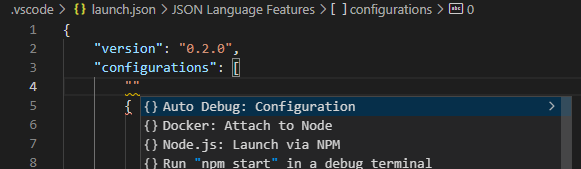
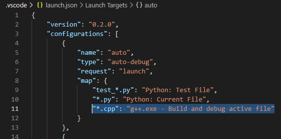
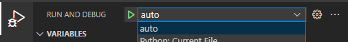

# Auto Debug

Automatically switches your debugger/launch configuration based on what file you have active. Enables automated language-aware debugging.

## Features

Allows you to create a new "auto" debugger that maps glob patterns (which will match to your active file name) and launch configuration names. For example:

```json
{
    "name": "auto",
    "type": "auto-debug",
    "request": "launch",
    "map": {
        "tests/*.py": "Python: Test Folder Debug",
        "*.py": "Python: Current File",
        "*.cpp": "g++.exe - Build and debug active file",
        "Makefile": "g++.exe - Build and debug Makefile project"
    }
}
```

When the "auto" debug configuration is selected, you'll no longer have to manually switch between debug configurations. Just run "auto" using F5 when the code you want to debug is open in an active tab. Auto Debug will then find the best debugger for your situation and run it. Letting you easily automate debugging for yourself, or make sure your developers never have to guess or read documentation to learn what the appropriate debugger configuration is for a particular situation.

Note that in cases where multiple matches are found for your active file, the first match in your "map" settings will be selected.

## Quick start

-   **Step 1.** Install the Auto Debug extension for Visual Studio Code.

-   **Step 2.** Create an "Auto Debug" configuration.



-   **Step 2.** Customize the "Auto Debug" configuration for your needs.



-   **Step 3.** Ensure you have "auto" selected in vscode's "Run and Debug" menu.



-   **Step 4.** Open a file you'd like to debug and press F5.

To stop using the automatic matching, simply go back to selecting debug profiles manually.

## Verbose Example

Here is an example **launch.json** file which lets the user switch between python tests, python scripts, and C++ automatically:

```json
{
    "version": "0.2.0",
    "configurations": [
        {
            "name": "auto",
            "type": "auto-debug",
            "request": "launch",
            "map": {
                "test_*.py": "Python: Test File",
                "*.py": "Python: Current File",
                "*.cpp": "g++.exe - Build and debug active file"
            }
        },
        {
            "name": "Python: Current File",
            "type": "python",
            "request": "launch",
            "program": "${file}",
            "console": "integratedTerminal"
        },
        {
            "name": "Python: Test File",
            "type": "python",
            "request": "launch",
            "program": "${file}",
            "console": "integratedTerminal",
            "env": {
                "RUNNING_TEST": "true"
            },
        },
        {
            "name": "g++.exe - Build and debug active file",
            "type": "cppdbg",
            "request": "launch",
            "program": "${fileDirname}\\${fileBasenameNoExtension}.exe",
            "args": [],
            "stopAtEntry": false,
            "cwd": "${workspaceFolder}",
            "environment": [],
            "externalConsole": false,
            "MIMode": "gdb",
            "miDebuggerPath": "C:\\msys64\\mingw64\\bin\\gdb.exe",
            "setupCommands": [
                {
                    "description": "Enable pretty-printing for gdb",
                    "text": "-enable-pretty-printing",
                    "ignoreFailures": true
                }
            ],
            "preLaunchTask": "C/C++: g++.exe build active file"
        }
    ]
}
```

## Known Issues

None.

## Release Notes

### 1.0.0

Initial release of Auto Debug
